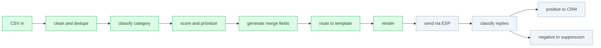

# DexaFit provider outreach workflow

A small, readable pipeline that turns a messy list of healthcare provider leads into
personalized, segmented outreach for the DexaFit provider marketplace. It runs
end to end on committed mock data with no API keys.

**The strategy sits in the memo, not here:** [strategy/marketplace-memo.md](strategy/marketplace-memo.md)
([PDF](strategy/marketplace-memo.pdf), 4 pages). That is the primary deliverable. It
covers what DexaFit is selling, how a referral is priced, the tier structure, and why the
launch is deliberately capped. The machine
readable tier table is [strategy/pricing_model.csv](strategy/pricing_model.csv). This
README documents the **workflow** that operationalizes it, so it does not repeat the
pricing rationale or pilot design. Read the memo first. Everything below runs on 50
synthetic leads standing in for the real 1,000, deliberately messy because scraped
lists always are.

```
pip install -r requirements.txt
python src/segment.py       # clean, classify, score, dedupe, flag
python src/personalize.py   # generate merge fields and the personalized opener
python src/render.py        # render sample emails and the funnel scenarios
```

## Pipeline



Green is implemented in this repo. Grey is described here but out of scope for a three
hour build: real ESP integration, reply classification, and CRM or suppression sync.

## Segmentation and prioritization

`segment.py` reads `data/leads_raw.csv` and `config/campaign.yaml` and writes
`data/leads_segmented.csv`. No row is ever dropped. Exclusion is a flag, not a delete,
so the full list stays auditable.

**Category is a routing bucket, not a job title.** The four values are `nutrition`,
`fitness`, `clinical`, and `unclassified`. A Physician Assistant is not a physician,
but the routing only cares which value proposition applies, so a PA lands in
`clinical`. The classifier emits a confidence and punts rather than guessing when a
title carries no usable signal.

| Signal in title or practice name | Category | Confidence |
|---|---|---|
| RD, RDN, Registered Dietitian, Nutritionist, Nutrition Coach | nutrition | high |
| CPT, Personal Trainer, Strength Coach, Performance Coach | fitness | high |
| MD, DO, Physician Assistant, NP, or a clinic or medical practice name | clinical | high |
| Health Coach | nutrition | low |
| Director of Performance | fitness if the practice name supports it, else unclassified | low |
| Founder, Owner, Wellness Director with no other signal | unclassified | n/a |

Low confidence rows still send, they just get a more generic opener. Unclassified rows
do not send.

**Scoring is driven by intent and relationship, never by provider type.** Which
category converts best is exactly what the pilot exists to find out, so pre weighting a
category would bias the result we are trying to measure. Weights are configurable
starting points in `config/campaign.yaml`, to be recalibrated after the first two
hundred sends.

| Weight | Points |
|---|---|
| existing_relationship (a relationship note is present) | 30 |
| inbound_form | 25 |
| partner_referral | 20 |
| launch_market | 20 |
| multi_provider_signal (clinic or group practice name) | 15 |
| complete_profile (all core fields present) | 10 |
| high_classification_confidence | 5 |

Raw weights sum to 125 and the final score is capped at 100, so the strongest leads sit
at the ceiling rather than running away from the rest. `template_key`, `campaign_track`,
and `priority_score` stay separate fields on purpose, since a single composite segment
key multiplies out of control as dimensions are added.

Every excluded row carries one reason from an exhaustive list: `missing_email`,
`duplicate_of:<id>`, `unclassified_profession`, or `outside_launch_market`. Waitlist
leads are retained for a future campaign but excluded here, because the founding cohort
copy names a specific location and sending it to a city with no DexaFit location would
be incoherent.

Verbatim `segment.py` output on the mock data:

```
Total leads in: 50
Sendable this campaign: 27
Excluded: 23

By profession (all rows):
  nutrition      19
  fitness        17
  clinical       10
  unclassified    4

By classification confidence:
  high  41
  low    5
  n/a    4

By temperature:
  cold  38
  warm  12

By market tier:
  launch    31
  waitlist  19

Exclusions by reason:
  outside_launch_market    17
  unclassified_profession   4
  duplicate_of              1
  missing_email             1
```

## Personalization

`personalize.py` generates the merge field values each email needs. The one genuinely
personalized line is the `opener`. It is produced two ways.

`build_opener_prompt(lead)` returns the exact payload that would be sent to a model in
production. It builds the string and returns it, it does not call anything, so the
whole workflow stays reviewable without credentials. Prompt design is part of what is
being demonstrated, so here is the real payload for a warm nutrition lead:

```
You write the first line of a cold outreach email to a healthcare provider for
DexaFit, a body composition testing company launching a referral marketplace.

Rules:
- One sentence, under 25 words.
- Plain and specific. No adjectives, no flattery, no exclamation marks.
- If a relationship note is present, reference it naturally.
- Otherwise reference the practice specialty if one is given.
- Otherwise reference their city and profession only.
- Never invent facts not present in the fields below.

Provider fields:
  first_name: Dana
  profession: nutrition
  practice_name: Balance Nutrition Boston
  city: Boston
  relationship_note: met at Boston open house in May
```

`generate_opener_rules(lead)` is the deterministic fallback that actually populates the
CSV, and it emits a `personalization_confidence` from the branch that fired:

- **high:** a warm lead with a relationship note, opener built from the note.
- **medium:** a practice name with a recognizable specialty, opener references it.
- **low:** neither, opener falls back to city plus category.

Low confidence is the human in the loop boundary. On this list, 14 of 27 sendable
openers are low confidence, and in production those first lines would be written by
hand. `nearest_location` resolves only to a configured launch market or to
`Future market`, it never fabricates a distance, and production would swap in DexaFit's
real location data plus geocoding.

## Email sequence

Three touches, not five. The offer is strong enough that it does not need six weeks of
nurture, and a short sequence gets through the list and learns faster. Timing lives in
`config/campaign.yaml` (`e1` day 0, `e2` day 3, `e3` day 8). One template per category
in `templates/` carries the right value proposition: nutrition gets a client who arrives
with data, fitness gets measurable goals and re scan retention, clinical gets continuity
of care, meaning a client the practice already has data on routed back for follow up.

The CTA escalates then de escalates on purpose. E1 opens low friction, E2 makes one
referral concrete and points to the application, E3 steps commitment back down with an
explicit out, replying "later".

**Clinical does not use the same E1 ask.** Nutrition and fitness close on "worth fifteen
minutes?", which suits a solo practitioner who books their own calendar. A physician
referral decision is rarely made that way, so clinical closes by offering information
instead, "happy to send over how the routing and data handoff work". Same sequence
structure, different ask, because the buying process is different. The founding offer waives the listing fee during the
pilot, so no email mentions the post pilot `$99` or `$249`. The copy may say a referral
is exclusive, a product decision DexaFit controls, but it never promises referral
volume, because supply is the binding constraint and we cannot prove volume yet.

Only E1 carries a subject line A/B test: two arms testing provider benefit against
founding cohort scarcity, with the same two hypotheses across all three categories so
results pool rather than fragment. Assignment sorts eligible leads by the SHA256 hash of
`lead_id` and alternates arms, so the split stays within one lead of even rather than
only even on average. **This campaign is underpowered to declare a subject line
winner.** The pilot produces directional evidence, not statistical proof. The signals
worth reading are reply quality, the objections providers raise, and conversion by
category and temperature.

## Reply routing

Described, not implemented:

```
Positive reply        -> CRM opportunity
Question or objection -> manual review
Not interested        -> suppression list
Out of office         -> requeue
No reply after E3     -> stop
```

## Sample output

Fifteen emails (three touches for five representative leads) are rendered in
[output/sample_emails.md](output/sample_emails.md), with excluded rows listed by reason
at the bottom. The funnel scenarios from the memo are in
[output/funnel_scenarios.csv](output/funnel_scenarios.csv): planning assumptions, not
forecasts, with the base case already at the referral supply ceiling. Three inline here
so nothing needs clicking through.

**E1, nutrition, warm, high personalization (arm A, provider benefit):**

> Subject: Referrals from DexaFit Boston clients who already have their body comp data
>
> Hi Dana,
>
> Picking this back up since we first connected (met at Boston open house in May).
>
> I work with DexaFit, the body composition and metabolic testing clinics. DexaFit
> Boston runs DEXA, RMR, and VO2 max scans, and after every one of them the client asks
> some version of "okay, so what do I do now?"
>
> Right now we mostly say "find a good nutritionist." We are changing that. We are
> building a small vetted group we route those clients to directly, with their scan data
> attached.
>
> No listing fee during the pilot. You pay only when you accept a referral, and each one
> goes to you alone rather than to five people at once.
>
> We are taking 8 nutritionists in Boston. Worth fifteen minutes?
>
> Tommy

**E1, fitness, cold, low personalization (arm B, founding cohort scarcity):**

> Subject: 8 coaching slots in Boston
>
> Hi Marcus,
>
> Reaching out to a few coaches in Boston.
>
> I work with DexaFit, the body composition and metabolic testing clinics. DexaFit
> Boston runs DEXA, RMR, and VO2 max scans, and afterward the client asks some version
> of "okay, what should I train for now?"
>
> Today we just say "find a good coach." We are changing that. We are building a small
> vetted group we route those clients to directly, with their scan data attached, so you
> can set goals against a real baseline and prove progress on the re scan.
>
> No listing fee during the pilot. You pay only when you accept a referral, and each one
> goes to you alone rather than to five coaches at once.
>
> We are taking 8 coaches in Boston. Worth fifteen minutes?
>
> Tommy

**E3, nutrition (the low friction close):**

> Subject: Closing the Boston group this week
>
> Hi Dana,
>
> We are finalizing the Boston founding group this week, so this is my last note about it.
>
> If the timing is wrong, no problem at all. Reply "later" and I will check back when we
> open the next round.
>
> If you want in: https://apply.dexafit.example/founding-cohort
>
> Tommy

Note: `slots_remaining` should reflect confirmed pilot capacity before any live send.
The "8" and "11" here are configured examples.

## What is not built, and why

Held back to stay inside the time budget, and because several should be decided with
data rather than guessed at now:

- **Deliverability:** domain warming, sending infrastructure, list validation. Required
  before any real send, but it is execution, not strategy.
- **Consent and compliance review** of the list before contact.
- **Reply classification** and the CRM and suppression sync that follows it.
- **Real ESP integration.** The render step stops at message text.

## Closing

The real 1,000 lead list will arrive with a different schema and its own data quality
issues. Mapping it into this pipeline is a short exercise, mostly a column rename at the
`leads_raw.csv` boundary. The segmentation, scoring, and personalization logic carries
over unchanged.
